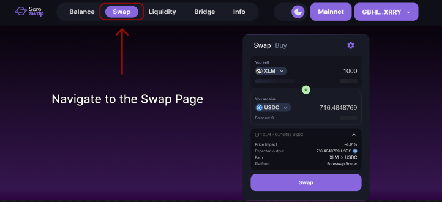

# Swap

A **swap** is the process of exchanging one Stellar asset for another using liquidity from Soroban-based [**Automated Market Makers (AMMs**](amm.md)**)**. Swaps can be executed directly through the [**Soroswap AMM** ](https://docs.soroswap.finance/01-protocol-overview)or routed via the [**Aggregator**,](https://docs.soroswap.finance/01-concepts/aggregator) which optimally resolves the operation by finding the **best available price at the time** through an **intelligent distribution** across supported AMMs.\
\
👉🏽 [How to Swap](https://docs.soroswap.finance/readme/getting-started/how-to-swap)\
Follow the [Swap Tutorial](https://docs.soroswap.finance/05-tutorial/05-doing-swap)

<figure><figcaption></figcaption></figure>

### How does a swap work?

**User selects two assets** – one to sell and one to receive.

1. **Input amount is defined** – the app estimates the output based on current pool conditions.
2. **Router SDK scans available pools** – if the Aggregator is enabled, it calculates the best distribution **`DexDistribution`**.
3. **User confirms the swap** – the smart contract receives the input asset and performs the swap.
4. **User receives the new asset** – if it's the first time, a **trustline** must be signed to accept the asset.

### 📐 Constant Product Formula

Each AMM in Soroswap follows this formula:

```
x * y = k
```

Where:

* `x` = balance of asset A
* `y` = balance of asset B
* `k` = constant product (remains unchanged)

When someone swaps A for B:

* A is deposited into the pool
* B is withdrawn
* The price updates to maintain the balance

This model ensures continuous liquidity.

🔜 **Next:** [Fees](https://docs.soroswap.finance/01-concepts/01-fees)\
🔙 **Previous:** [Liquidity Pools](https://docs.soroswap.finance/01-concepts/02-pools)
