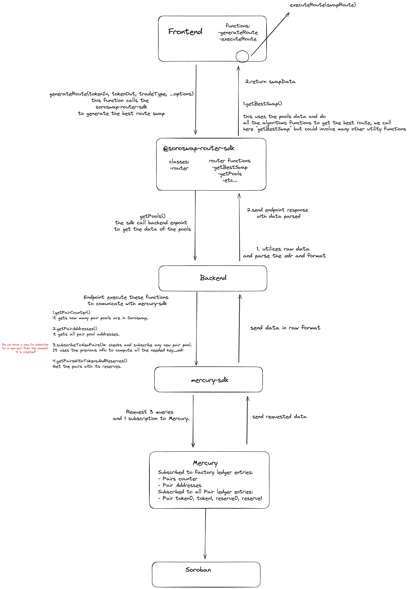

# Optimal Route

Soroswap Optimal Routing is a key component of the Soroswap protocol, designed to find the most efficient route for executing swaps. By leveraging a combination of the solutions implemented by 1Inch and Uniswap, Soroswap aims to provide users with the best possible trading experience.

## Background

We explored 3 protocols: Uniswap, PancakeSwap and 1Inch

### Uniswap & PancakeSwap

How it works: Uniswap and PancakeSwap work in a similar way: In the frontend they use an sdk to get the best route.

The algorithm to get the best route is the following:

1. Retrieving Available Pools: The algorithm starts by fetching all the available pools on the client side. This is done by querying the subgraph to get the list of pools. ([see here](https://github.com/Uniswap/smart-order-router/blob/9dda6a965e7f5c0e48efa8214363a660ed034350/src/providers/v2/subgraph-provider.ts#L78)).
2. Computing All Routes: Once the pools are obtained, the algorithm computes all possible routes for a given swap. The maximum number of pools that a route can have is determined by a parameter called maxHops. This step is implemented in the computeAllRoutes function. (see [computeAllRoutes](https://github.com/Uniswap/smart-order-router/blob/9dda6a965e7f5c0e48efa8214363a660ed034350/src/routers/alpha-router/functions/compute-all-routes.ts#L67)). MaxHops is the maximum number of pools that the route can have.
3. Splitting the Route: In order to optimize the routing process, the algorithm splits the route into smaller segments. This is done by defining a minimum percentage for a split. The algorithm creates an array by dividing 100% by the minimum percentage. For example, if the minimum percentage is 5%, then the array will be \[5, 10, 15, 20, 25, 30, 35, 40, 45, 50, 55, 60, 65, 70, 75, 80, 85, 90, 95]. Each segment represents a portion of the total route. ([see here](https://github.com/Uniswap/smart-order-router/blob/main/src/routers/alpha-router/functions/best-swap-route.ts#L146))
4. Obtaining Quotes: For each segment of the route, the algorithm obtains a quote. This quote represents the estimated amount of tokens that will be received (exact input) or sent (exact output) for that particular segment of the route.
5. Combining and Validating Routes: After obtaining quotes for each segment, the algorithm combines and validates all the routes along with their respective quotes. This step ensures that the combined routes form a valid and optimal path for the swap.
6. Choosing the Best Quote: Finally, the algorithm selects the best quote based on certain criteria. This can be either the minimum amount of tokens to be sent (amountIn) or the maximum amount of tokens to be received (amountOut). The quote with the best value is chosen as the optimal route for executing the swap.

They also keep routes on cache

Useful links:

* [getQuote function on clientSideSmartOrderRouter](https://github.com/Uniswap/interface/blob/4ee70bfa34d4435d992cc54d2510572ec9de3d4d/apps/web/src/lib/hooks/routing/clientSideSmartOrderRouter.ts)
* [best swap route](https://github.com/Uniswap/smart-order-router/blob/main/src/routers/alpha-router/functions/best-swap-route.ts#L146)
* [generateRoute example](https://github.com/Uniswap/examples/blob/main/v3-sdk/routing/src/example/Example.tsx)
* [pancakeSwap smart route example](https://github.com/pancakeswap/smart-router-example/tree/master/src)
* [Pancake Swap Frontend Smart Route implementation](https://github.com/pancakeswap/pancake-frontend/tree/develop/packages/smart-router)
* [Uniswap Blog on Auto Router](https://blog.uniswap.org/auto-router-v2)

### 1Inch

They call an API called Pathfinder to get the best route across multiple protocols. However, the API is not open source and we don't know how it works.

1inch also have their OneSplit smartcontract which serves as an agregator, the information can be found [here](../../aggregator/01-1inch.md)

## Soroswap Optimal Routing

The technical architecture for Soroswap Optimal Routing involves several interconnected parts. At the core, we have the Soroswap-router-sdk, responsible for managing all the logic related to the optimal route swap. This component utilizes a similar algorithm to Uniswap and PancakeSwap, enabling it to compute the best route for a given swap.



### Frontend

[Github Repository](https://github.com/soroswap/frontend)

The frontend will have the following functions:

```javascript
generateRoute(tokenIn, tokenOut, TradeType, ...options);
executeRoute(swapRoute);
```

These functions call directly the `@soroswap-router-sdk` methods to implement it

generateRoute will call the sdk to get the transaction data of the optimal route and then executeRoute will run the transaction.

### soroswap-router-sdk

[Github Repository](https://github.com/soroswap/soroswap-router-sdk)

Overall, we need the following methods:

```javascript
class router {
   getPools(tokenIn, tokenOut)
   getBestRoute(tokenIn, tokenOut, TradeType, ...options)
}
```

getPools will comunicate with the backend to get the data of the pools (token0, token1, reserve0, reserve1).

getBestRoute will utilize the pools data and run the algorithm to generate the optimal route for the swap returning the necessary data to execute the transaction.

#### Validation with token lists

Soroswap will build routes with only known trusted tokens.

Thus, Soroswap will maintain a token of known list of tokens. See [here](https://github.com/soroswap/token-list).

This list will be used to validate the tokens used in the swap. This will be done inside the private method `_getAllRoutes`, by the function `_validateKnownTokens`. Inside the soroswap-router-sdk.

`_validateKnownTokens` will fetch the known tokens list from the `token-list` repository and validate that the tokens used in the swap are in the list.

This will protect Soroswap from executing a transaction with a malicious token in the middle of the route. Also it will allow Soroswap to allow an advanced user to swap a token that is not in the known tokens list with proper warnings and disclaimers.

### Backend

[Github Repository](https://github.com/soroswap/backend.git)

Data requests summary:

* Instance storage of Factory Contract
* Persistent storage of Factory Contract
* Instance storage of all the pairs

The backend plays a crucial role in the optimal routing process. It communicates with the `@mercury-sdk` to retrieve the necessary data required by the `@soroswap-router-sdk`. Specifically, the backend needs endpoints to fetch pools with reserves from the `mercury-sdk`.

The difference between Mercury and subgraph is that Mercury give us the data we need in XDR. We just need to add a method to parse the data to use it in the `@soroswap-router-sdk`

It will have the endpoints to be called by the `soroswap-router-sdk` It will have the following functions:

```javascript
getPairCounter();
getPairAddresses();
subscribeToNewPairs();
getPairsWithTokenAndReserves();
```

`getPairCounter` will return the number of pairs stored in the Factory contract. This is stored in **instance** storage. `getPairAddresses` will return the addresses of the pairs stored in the Factory contract. It will use the `getPairCounter` to know how many pairs are stored in the Factory contract, this will help us to create all the needed `key_xdr` to get the data from Mercury in just one query. This is stored in **persistent** storage. `subscribeToNewPairs` will subscribe to the Factory's new pairs when pools are created. `getPairsWithTokenAndReserves` will return the pairs with the reserves of the tokens. It will use the `getPairAddresses` to get the addresses of the pairs. We will precompute all the needed `key_xdr` to get the data from Mercury in just one query. This is stored in **instance** storage.

### Mercury-sdk

[Github Repository](https://github.com/paltalabs/mercury-sdk.git)

Mercury sdk is utilized to subscribe and query from mercury.

Here we will need to create the queries to return data from the pools, and subscribe to the addresses we need to track.

Subscribe to factory ledger entries, then query and get pair counter (Thus, get how many pairs exist) and their pair adresses. Subscribe to all pair ledger entries, then query to get token0, token1, reserve0, reserve1.

## Soroswap Aggregator

Additionally, Soroswap Aggregator extends the optimal routing capabilities by incorporating pools from other protocols, such as Comet, Phoenix and SDEX. Subscription methods are created to fetch pools from these protocols, and the same logic as Soroswap is applied.
