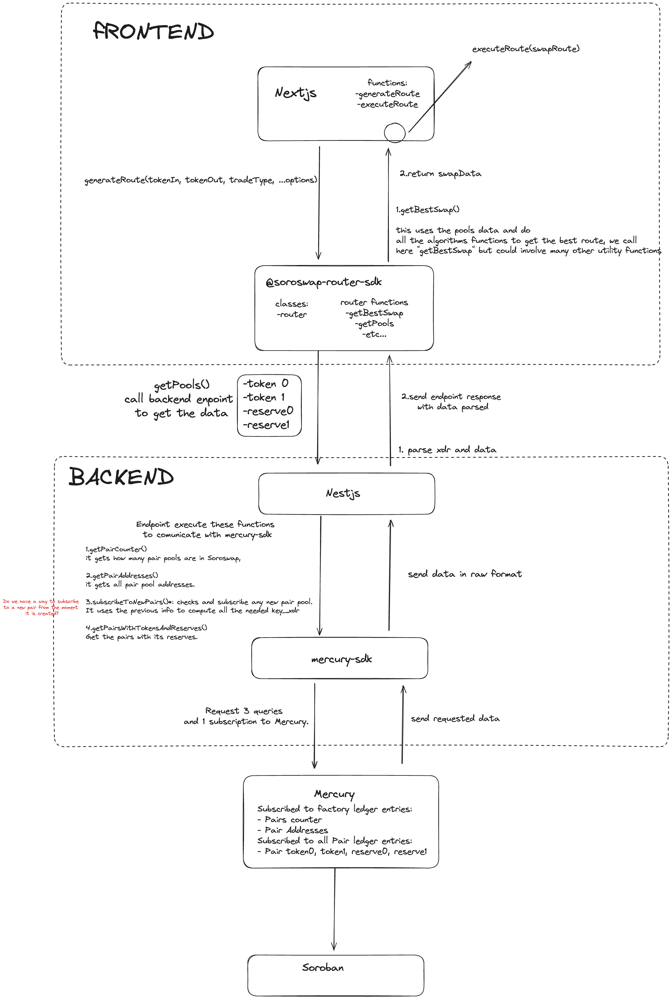

# Technical Architecture for Optimal Routing

Soroswap Optimal Routing is a key component of the Soroswap protocol, designed to find the most efficient route for executing swaps. By leveraging a combination of the solutions implemented by 1Inch and Uniswap, Soroswap aims to provide users with the best possible trading experience.

## Background

We explored 3 protocols: Uniswap, PancakeSwap and 1Inch

### Uniswap & PancakeSwap

How it works:
Uniswap and PancakeSwap work in a similar way: In the frontend they use an sdk to get the best route.

The algorithm to get the best route is the following:

1. Get all the pools: they ask to subgraph for the available pools ([see here](https://github.com/Uniswap/smart-order-router/blob/9dda6a965e7f5c0e48efa8214363a660ed034350/src/providers/v2/subgraph-provider.ts#L78)).
2. Computes all routes given a maxHops (see [computeAllRoutes](https://github.com/Uniswap/smart-order-router/blob/9dda6a965e7f5c0e48efa8214363a660ed034350/src/routers/alpha-router/functions/compute-all-routes.ts#L67)). MaxHops is the maximum number of pools that the route can have.
3. splits the route ([see here](https://github.com/Uniswap/smart-order-router/blob/main/src/routers/alpha-router/functions/best-swap-route.ts#L146))
   1. They define a minimum percentage for a split and make an array of 100% divided by the minimum percentage: for example is minimum percentage is 5% then the array will be [5, 10, 15, 20, 25, 30, 35, 40, 45, 50, 55, 60, 65, 70, 75, 80, 85, 90, 95]
4. They get a quote for every split
5. They validate all routes with quotes
6. Then choose the best quote (minimum amountIn or maximum amountOut)

They also keep routes on cache

Useful links:
- [getQuote function on clientSideSmartOrderRouter](https://github.com/Uniswap/interface/blob/4ee70bfa34d4435d992cc54d2510572ec9de3d4d/apps/web/src/lib/hooks/routing/clientSideSmartOrderRouter.ts)
- [best swap route](https://github.com/Uniswap/smart-order-router/blob/main/src/routers/alpha-router/functions/best-swap-route.ts#L146)
- [generateRoute example](https://github.com/Uniswap/examples/blob/main/v3-sdk/routing/src/example/Example.tsx)
- [pancakeSwap smart route example](https://github.com/pancakeswap/smart-router-example/tree/master/src)
- [Pancake Swap Frontend Smart Route implementation](https://github.com/pancakeswap/pancake-frontend/tree/develop/packages/smart-router)
- [Uniswap Blog on Auto Router](https://blog.uniswap.org/auto-router-v2)

### 1Inch

They call an API called Pathfinder to get the best route across multiple protocols. However, the API is not open source and we don't know how it works.

## Soroswap Optimal Routing

The technical architecture for Soroswap Optimal Routing involves several interconnected parts. At the core, we have the Soroswap-router-sdk, responsible for managing all the logic related to the optimal route swap. This component utilizes a similar algorithm to Uniswap and PancakeSwap, enabling it to compute the best route for a given swap.



### Soroswap-router-sdk

##### What will do ?

This will manage all the logic of the optimal route swap.

##### What we need ?

We need to create a class with all the methods and logic for the optimal route swap and connect it with the backend to get the necessary data for the algorithm.
This will get all the pools from the backend and then will compute the best route. It will use a similar algorithm as Uniswap and PancakeSwap.

### Frontend

##### What will do ?
repository: https//github.com/soroswap/frontend

The frontend will have the following functions:
```javascript
generateRoute(tokenIn, tokenOut, TradeType, ...options)
executeRoute(swapRoute)
```
These functions call directly the `@soroswap-router-sdk` methods to implement it

### soroswap-router-sdk
repository: https://github.com/soroswap/soroswap-router-sdk

It will have the following methods:
```javascript
class router {
      getPools(tokenIn, tokenOut)
      getBestRoute(tokenIn, tokenOut, TradeType, ...options)
   }
```

##### What we need ?

We don't need anything special here more than implement the `@soroswap-router-sdk` in the frontend

### Backend
repository: https://github.com/soroswap/backend.git

The backend plays a crucial role in the optimal routing process. It communicates with the `@mercury-sdk` to retrieve the necessary data required by the `@soroswap-router-sdk`. Specifically, the backend needs endpoints to fetch pools with reserves from the `mercury-sdk`.

The difference Mercury and subgraph is that Mercury give us the data we need in XDR. We just need to add a method to parse the data to use it in the `@soroswap-router-sdk`

It will have the endpoints to be called by the `soroswap-router-sdk`
It will have the following functions:
```javascript
getPairCounter()
getPairAddresses()
subscribeToNewPairs()
getPairsWithTokenAndReserves()
```

`getPairCounter` will return the number of pairs stored in the Factory contract. This is stored in __instance__ storage.
`getPairAddresses` will return the addresses of the pairs stored in the Factory contract. It will use the `getPairCounter` to know how many pairs are stored in the Factory contract, this will help us to create all the needed `key_xdr` to get the data from Mercury in just one query. This is stored in __persistent__ storage.
`subscribeToNewPairs` will subscribe to the Factory's new pairs when pools are created.
`getPairsWithTokenAndReserves` will return the pairs with the reserves of the tokens. It will use the `getPairAddresses` to get the addresses of the pairs. We will precompute all the needed `key_xdr` to get the data from Mercury in just one query. This is stored in __instance__ storage

##### What will do ?

Will call the necessary data from `@mercury-sdk` to send to the `@soroswap-router-sdk`

##### What we need?

We need endpoints to get the pools with reserves from `mercury-sdk` filter by (token0, token1)

### Mercury-sdk
repository: https://github.com/paltalabs/mercury-sdk.git

##### What will do ?

Will manage the methods to subscribe and retrieve the needed information by the backend

##### What we need ?

We need query and methods to get the pools from mercury and then parse the data to use this in the backend

## Soroswap Aggregator

Additionally, Soroswap Aggregator extends the optimal routing capabilities by incorporating pools from other protocols. Subscription methods are created to fetch pools from these protocols, and the same logic as Soroswap is applied.