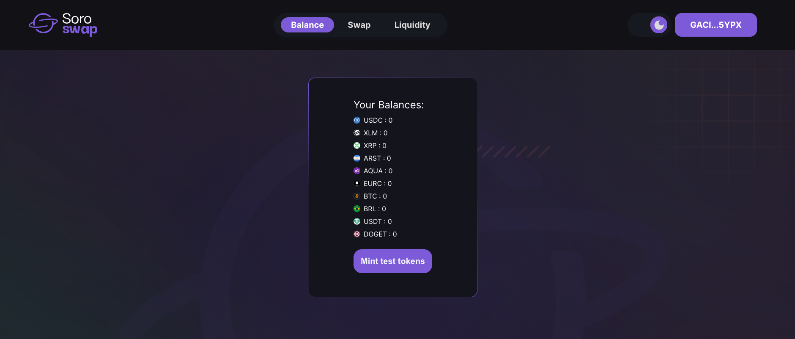
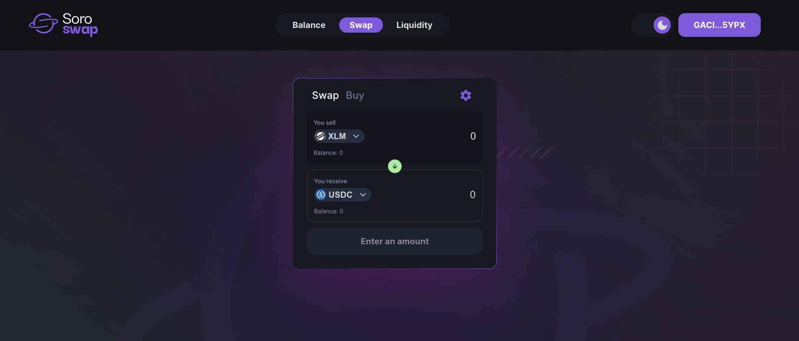
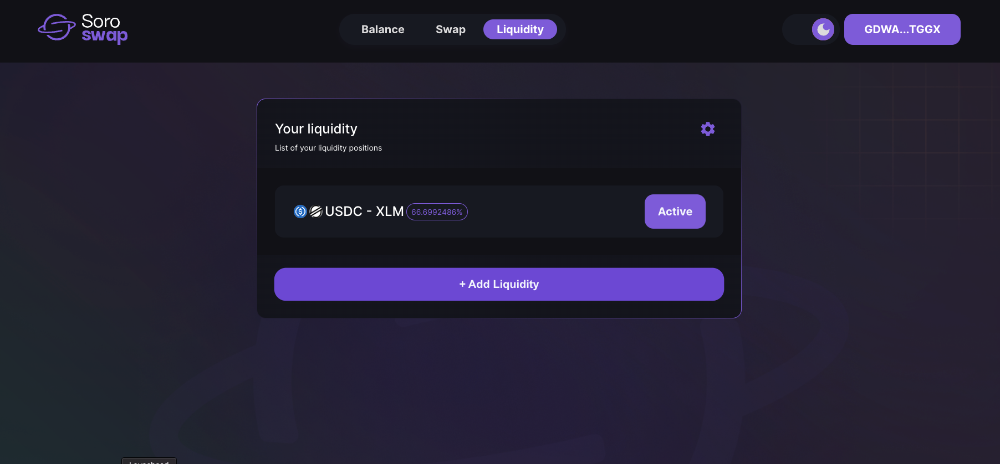
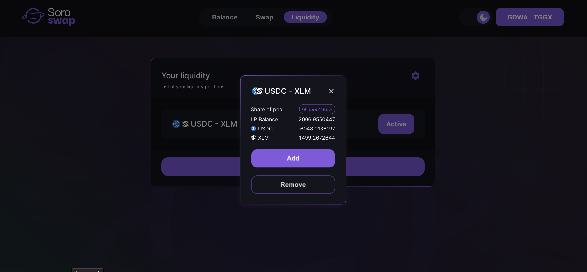
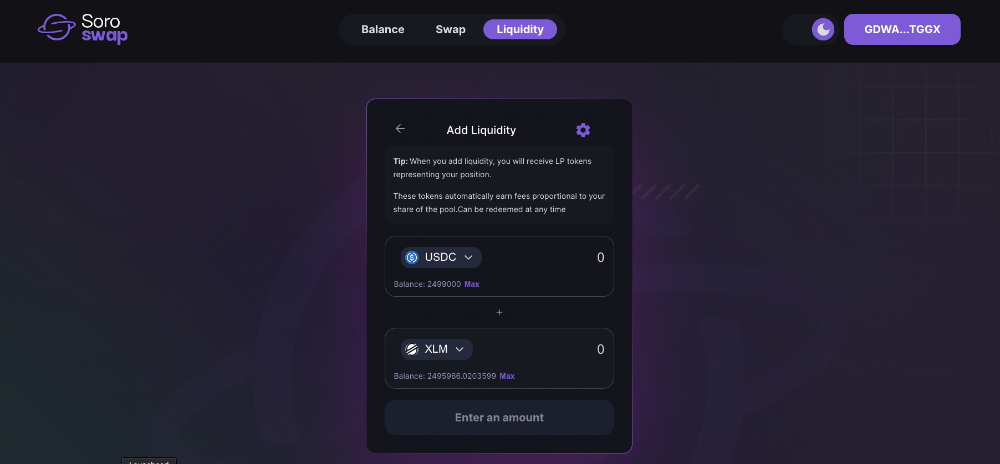
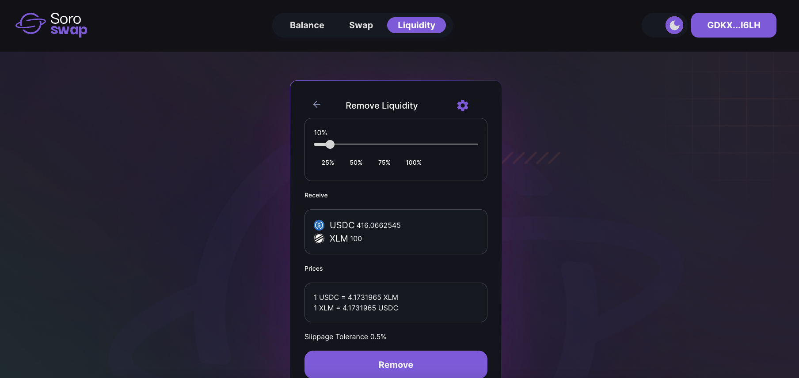

# Checking Soroswap Sections

Soroswap offers a user-friendly interface with various sections to enhance your crypto experience. Let's explore the key sections available:

## Balance Section

In the Balance section, you can conveniently view your test token balances. This feature allows you to keep track of your assets and monitor their availability for transactions within the app. Additionally, you have the ability to mint tokens, enabling you to interact seamlessly with the application.

## Swap Section

The Swap section is where the magic happens! Here, you can easily swap tokens that are part of the liquidity pool. Whether you're looking to exchange one token for another or simply diversify your portfolio, the Swap section provides a straightforward and efficient solution.

## Liquidity Section

The Liquidity section empowers you to add or remove liquidity from the pools. By participating in liquidity provision, you contribute to the stability and efficiency of the Soroswap ecosystem. This section allows you to manage your liquidity positions effectively, ensuring a smooth and rewarding experience.

**Select a liquidity pool:** In this section, you can choose a specific liquidity pool to view its information and take further actions such as adding or removing liquidity.

**Adding liquidity:** By accessing the "Adding liquidity" section, you can contribute to a liquidity pool by depositing values of two different tokens. This process helps maintain the balance and liquidity within the pool, allowing for efficient trading and transactions.

**Removing liquidity:** In the "Removing liquidity" section, you have the option to withdraw your share of liquidity from a specific pool. This action allows you to reclaim your tokens and adjust your liquidity positions as needed.

With these three essential sections, Soroswap offers a comprehensive platform for you to explore, trade, and engage with the world of cryptocurrencies. Now that we have familiarized ourselves with these sections, let's continue with the tutorial, where we will delve into each section in more detail. Get ready to dive deeper into Soroswap and discover the exciting features it has to offer!
