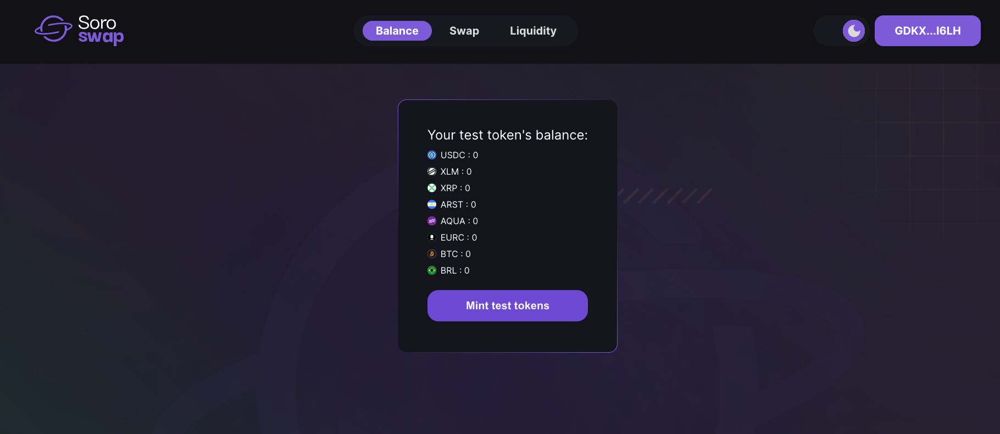

# Adding Liquidity

Now that we have our wallet set up correctly in the testnet, we are ready to use the [Soroswap app](https://soroswap.finance). Let's start by adding liquidity to a pool.

## Step 1: Setup

To begin adding liquidity, we need to first mint test tokens to interact with the app.

1. Go to the Balances page.
2. Click the "Mint test tokens" button.

After minting your test tokens, ensure that your wallet is funded with at least 1XLM in Stellar. To fund your wallet in the testnet, you can use the friendbot. Simply go to your wallet and click "Fund with Friendbot".

Verify that your account has been funded with XLM, and now we are ready to continue navigating the app.

## Step 2: Go to the Add Liquidity page

1. Navigate to the Liquidity page, where you will find all the liquidity positions.
2. Click the "Add Liquidity" button.

This will take you to a page like this:

## Step 3: Select the tokens and provide liquidity

1. Click the token selectors.
2. Select the tokens for which you would like to provide liquidity.
3. Enter the amount you want to provide.
4. Click "Supply".

This will open a modal where you can view information about the liquidity position, such as the amount of Liquidity Pool Tokens that will be created and your share percentage of the pool.

5. Click the "Add liquidity" button, and you will see a transaction in your Freighter wallet.

6. Click "Approve" and wait for the transaction to be confirmed.
7. Once the transaction is complete, you will see a success message like this:

Congratulations! You have successfully added liquidity. Now you can view your liquidity position on the Liquidity page.

Now we can continue with the tutorial. The next steps will involve swapping tokens for the ones you have provided liquidity for.
