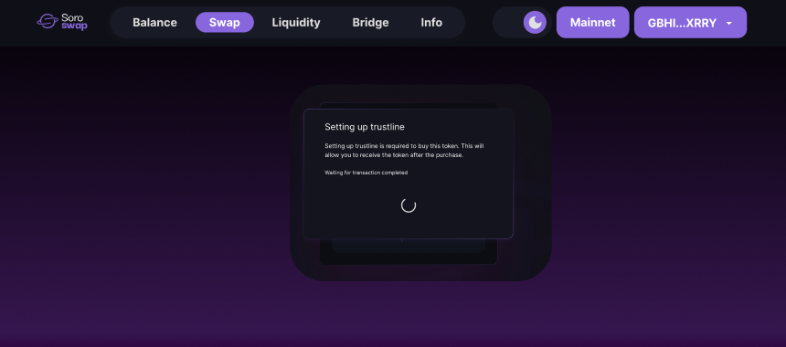

# Doing Swaps

Now that you have successfully added liquidity to a pool, let's move on to the next step: doing swaps. Swapping tokens on Soroswap allows you to exchange one token for another within the liquidity pool. Follow the steps below to perform a swap:

## Step 1: Navigate to the Swap page

1. Go to the Soroswap app and click on the "Swap" tab in the navigation menu.

## Step 2: Select the tokens for the swap

1. In the top section, select the token you want to sell.
2. In the bottom section, select the token you want to receive.

For example, let's use the XLM/USDC pair, which is the pair we provided liquidity for in the previous section.

## Step 3: Enter the swap amount

Enter the amount you desire to swap. Make sure to align it with your balances and the liquidity pool reserves, or the swap button will be disabled.

## Step 4: Review and confirm the swap

1. Click the "Swap" button.
2. Take a moment to review the details of the swap, including the estimated amount and any applicable fees.
3. If everything looks correct, click the "Confirm Swap" button to proceed.

## Step 5: Trustlines

When you swap a token for the first time on Soroswap.Finance, you'll need to sign a "trustline" transaction.
Trustlines are an explicit authorization that allows your account to hold and exchange a specific asset.

## Step 6: Confirm the transaction

1. Your Freighter wallet will open, displaying the transaction details.
2. Review the transaction information and click "Approve" to confirm the swap.
3. Wait for the transaction to be confirmed on the blockchain.

## Step 7: View the transaction details

1. Once the transaction is confirmed, you will see a success message indicating that the swap was completed.
2. You can also view the transaction details with the transaction hash or by clicking "View on explorer".

Congratulations! You have successfully performed a swap on Soroswap. You can now explore the liquidity pools and continue to engage with the exciting world of decentralized finance. In the next step, we will learn how to remove liquidity from our liquidity positions.
