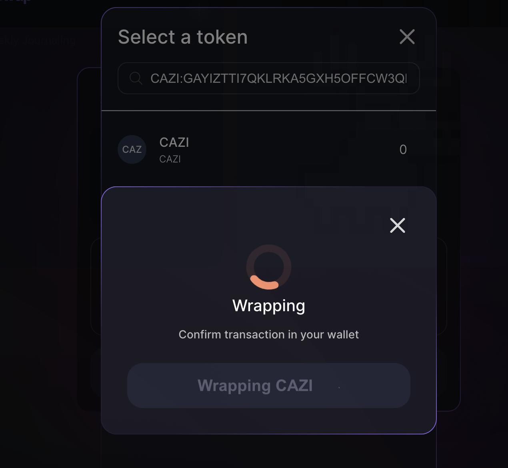

# Understanding the Importance of Wrapping Stellar Assets for Soroban

The Soroban network introduces a new era of smart contract functionality to the Stellar ecosystem. To fully leverage these advanced features, assets from the traditional Stellar network—often referred to as "Stellar Classic" assets—need to be adapted for compatibility. This is where the concept of 'wrapping' comes into play.

## What is Wrapping?

Wrapping is the process of representing a Stellar Classic asset on the Soroban network. It involves issuing a Soroban-native asset that is pegged on a 1:1 basis with the original Stellar asset. This wrapped version works seamlessly with Soroban's smart contracts and decentralized applications (dApps).

## Why Wrap Stellar Assets?

### Seamless Integration

Wrapped assets can interact with the Soroban network as if they were originally part of it, allowing for smooth transactions and smart contract interactions.

### Trading and Liquidity

Wrapping assets unlock the ability to trade on decentralized exchanges like Soroswap, providing liquidity and access to new markets within the Soroban ecosystem.

### Enhanced Functionality

Wrapped assets can utilize the full suite of functionalities offered by Soroban's advanced smart contract capabilities, which are not available to unwrapped assets.

## How Does Wrapping Benefit You?

### Accessibility

Enjoy access to a wider range of tokens and trading pairs on Soroswap, enhancing your trading experience.

### Efficiency

Execute transactions and smart contract operations with the speed and low cost associated with the Soroban network.

### Opportunity

Participate in new financial services and products developed on Soroban, from staking to yield farming.

Wrapping is a simple yet vital step in bridging the gap between Stellar Classic assets and the innovative Soroban network. By wrapping your assets, you're not just preparing for trading on Soroswap; you're unlocking a world of possibilities that only Soroban-enabled assets can offer.

---

# Wrapping Assets Directly on Soroswap

Soroswap simplifies the wrapping process by integrating it directly into the user interface. If you're looking to swap or provide liquidity with a Stellar Classic asset, Soroswap's intuitive search modal will assist you every step of the way.

## Wrapping via the Search Modal

Soroswap's search modal allows you to find your desired token. If you enter a `CODE:ISSUER` combination for a Stellar asset that isn't wrapped:

1. Soroswap will detect this and prompt you with a suggestion to wrap the asset.
2. A modal will appear, presenting you with the option to "Wrap Asset."
3. Upon confirming your choice, you will be prompted to sign the transaction with your wallet.
4. Once signed, the transaction is submitted, and the asset is wrapped into a Soroban-compatible format.

## Post-Wrapping: What’s Next?

After wrapping, the new Soroban-wrapped asset will appear in your Soroswap token list, ready to be traded or added to liquidity pools. You can now enjoy all the benefits of the Soroban network, including faster transaction speeds and reduced costs, with the added flexibility of engaging with the wider Stellar ecosystem.

_You will probably be shown this warning view if it is an unknown asset for us_

_If everything goes as expected you should now have your token selected_

By integrating asset wrapping into the swapping process, Soroswap ensures that users have a seamless experience, bridging the gap between Stellar Classic and Soroban networks. This feature not only enhances the usability of Soroswap but also enriches the overall ecosystem by fostering interoperability and ease of use.

Wrap your Stellar Classic assets on Soroswap today, and unlock the full potential of your trading experience on the Soroban network.
