## How to bridge

**Navigate to the Bridge section:**

From the navigation bar (located at the top of the application [or bottom if you are on a mobile device]), click on the **"Bridge"** button.

**Connect your Stellar wallet:**

-   In the top right corner of the screen, you will find a button with the text **"Connect Wallet"**. Click on it and a window will appear showing you all the wallets available to connect on Soroswap.
-   Connect your preferred Stellar wallet. 
>[!NOTE] (You may be asked for your credentials and your approval to connect to the site if this is the first time you are entering with that wallet).

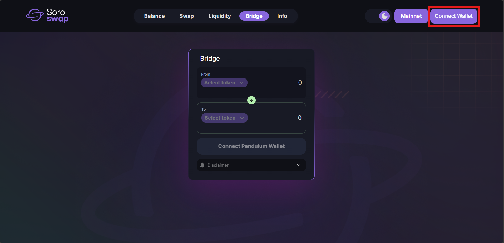

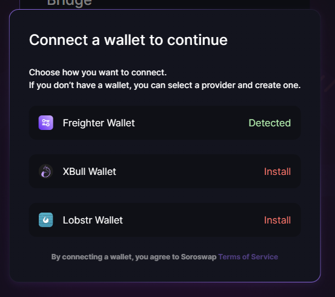

**Connect your Pendulum wallet:**

-   Click on the button that says **"Connect Pendulum wallet"** located in the lower center of the screen.
-   A window will appear showing you all the Pendulum wallets currently available on Soroswap.
-   Choose your preferred wallet and connect it to the application.

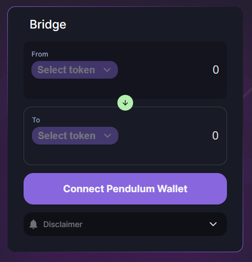

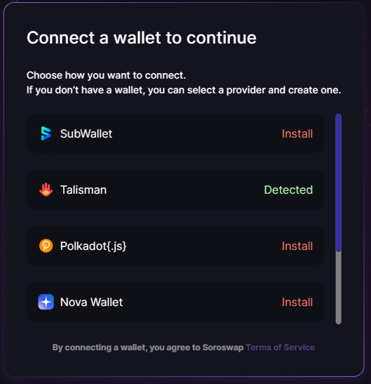

**Select the asset and the type of operation:**

-   To see the available bridge options, click on the drop-down menu with the text "Select token".
-   Select the chain from which you want to Issue/redeem assets.
>[!NOTE] Keep in mind that from Stellar it will create an "Issue" operation, while from Pendulum it will create a "Redeem" operation for the selected asset.

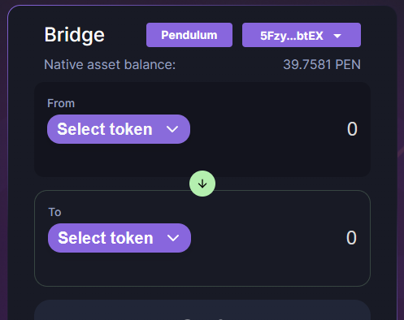

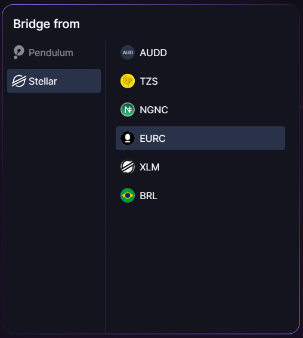

**Enter an amount:**

-   Back on the main Bridge view, you can enter an amount in the designated field.

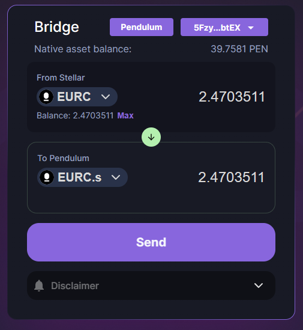

**Create the transaction:**

-   Click on the button with the text "Send" to create the transaction and a window will open showing the details of the operation to be performed.

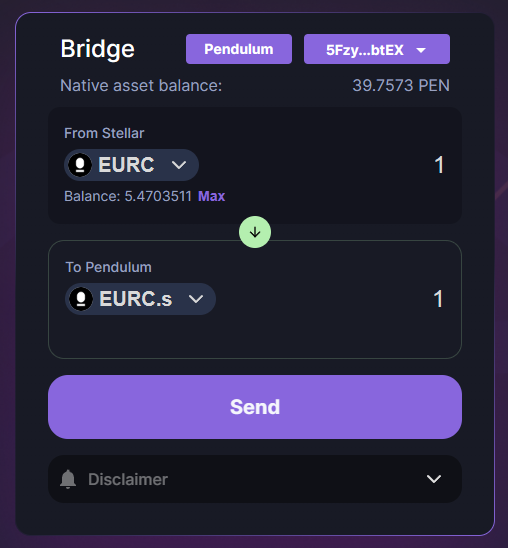

**Review the transaction:**

-   In this new window you can review details such as the amount to "issue" / "claim", the associated fees and the networks between which the bridge will be made.
-   Once you have verified that the data is correct, click on the **"Confirm"** button.

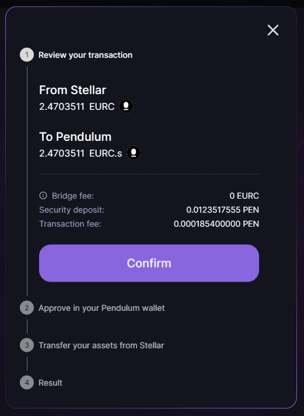

**Confirm the transaction in your Pendulum wallet:**

-   After confirming the data, your Pendulum wallet will open and ask you to approve this transaction.
-   Once approved, wait patiently for the window content to refresh 
>[!WARNING] Do not close this window or the transaction may fail.

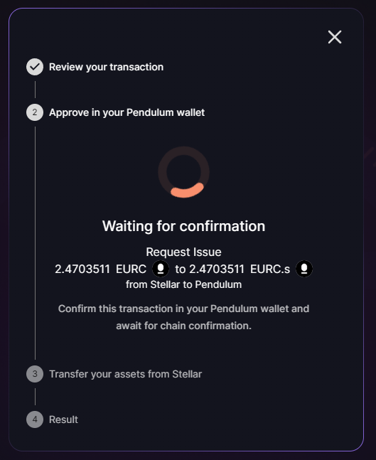

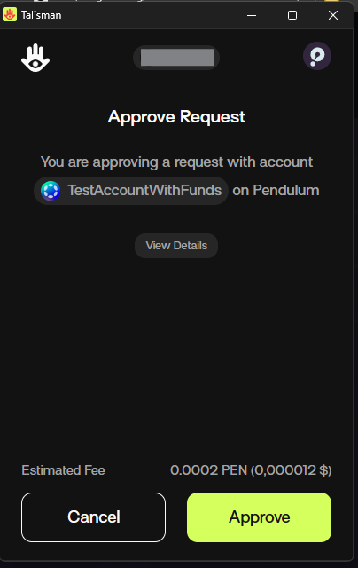

**(Optional) Make the payment with your Stellar wallet:**

-   If you are requesting to issue assets in Pendulum, you will have to deliver the equivalent value in Stellar assets, please make sure you have sufficient funds to perform the operation, otherwise it will fail.
-   Confirm the payment in your wallet and wait patiently for the information to be registered on the blockchain.

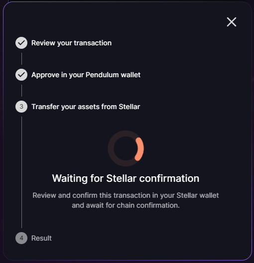

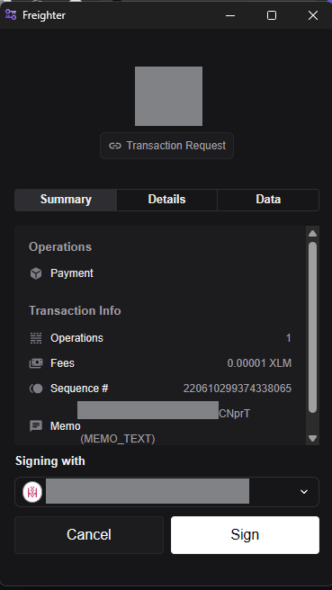

>[!TIP] After successfully completing these steps, the balances in your wallet should be updated. You can review the details of the operation directly by clicking on the **"view in explorer"** button.

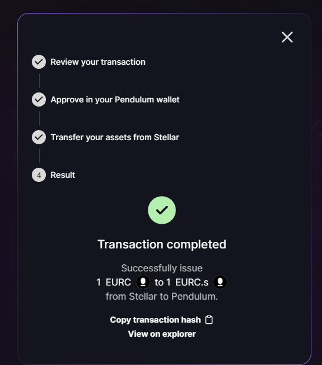