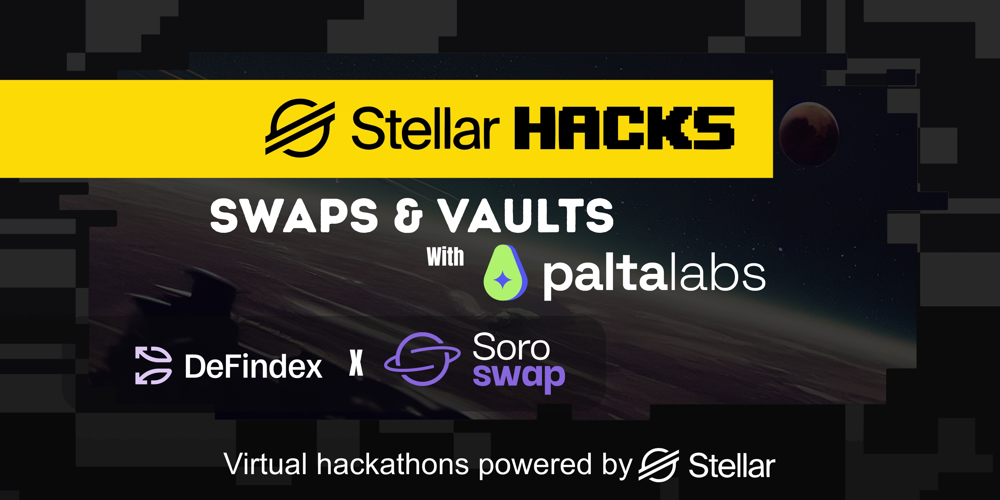

# Stellar Hacks: Swaps & Vaults 🥑

Welcome to the [**Stellar Hacks: Swaps & Vaults** hackathon](https://dorahacks.io/hackathon/stellar-hacks-paltalabs/detail)! This section provides all the resources and information you need to build amazing projects using Soroswap.Finance during the hackathon.

## What is Soroswap.Finance?

Soroswap.Finance is an open-source protocol that enables users to exchange one asset for another without relying on a centralized party. It also tackles the problem of liquidity fragmentation across Stellar. The development of Soroswap.Finance and its user interface is led by the **PaltaLabs** team.

## Soroswap.Finance Components 🔧

Soroswap.Finance includes three main components:

### 1. Soroswap AMM

🌀 **Automated Market Maker (AMM)** via [**Soroswap AMM**](https://docs.soroswap.finance/01-protocol-overview) for direct token swaps and liquidity provisioning

### 2. Soroswap Aggregator

🧠 **AMM Aggregator** via [**Soroswap Aggregator**](https://docs.soroswap.finance/soroswap-aggregator), optimizing trades across multiple protocols to secure the best execution

### 3. Soroswap Swap Route API

🛠️ **API route swap** via [**Soroswap API**](https://api.soroswap.finance/docs) The Soroswap API serves as the core interface to quote trades by aggregating liquidity from all available Stellar DEXs — including those on Soroban (Soroswap, Phoenix, Aqua) and the Stellar Classic DEX.

## Hackathon Resources 📚

### API Access

For the hackathon, please use our latest staging version:

**API**: [staging](https://soroswap-api-staging-436722401508.us-central1.run.app/)

you can use this API key
`sk_555cf339752c4efe09de45f9696332e83a8f83f02768796b11b3c055d0a667a8`

📮 **Postman Collection**: [Download Staging Postman Collection](https://drive.google.com/drive/folders/1G-LQYE2EojPWP1CSuuS_tDb9vjYbFR6E?usp=sharing)

> ⚠️ **Important**: Use the Staging Postman Collection for the hackathon.

### Community & Support

- **Discord**: [Join our Discord](https://discord.com/invite/qvhBEAWjgA)
- **API Docs**: [Soroswap API Documentation](https://api.soroswap.finance/docs)
- **GitHub**: [Soroswap Repository](https://github.com/soroswap/)
- **Telegram**:[Join telegram](https://t.me/+QsJFzFPTkmgwNjUx)

## Getting Started 🚀

1. **Register** in [DoraHacks](https://dorahacks.io/hackathon/stellar-hacks-paltalabs/detail)
2. **Join our Discord or telegram** to connect with other hackers and get support
3. **Explore the API** using our staging environment
4. **Check out our documentation** to understand the protocol
5. **Start building** your amazing project!

## What You Can Build 🛠️

With Soroswap.Finance, you can build:

- **DeFi Applications**: Lending platforms, yield farming, or yield aggregators
- **Trading Tools**: Advanced trading interfaces, portfolio managers, or arbitrage bots
- **Liquidity Solutions**: Automated liquidity management or cross-pool strategies
- **Analytics Platforms**: Real-time trading analytics or portfolio tracking
- **Mobile Apps**: Mobile-first DeFi experiences
- **Integration Tools**: Bridges, oracles, or cross-chain solutions

## Need Help? 🤝

- Ask questions in our [Discord](https://discord.com/invite/qvhBEAWjgA)
- Check our [technical documentation](../01-protocol-overview/README.md)
- Explore our [API documentation](https://api.soroswap.finance/docs)

---

**Happy Hacking!** 🎉

*Powered by [PaltaLabs](https://paltalabs.io/) and [Stellar](https://stellar.org/)* 