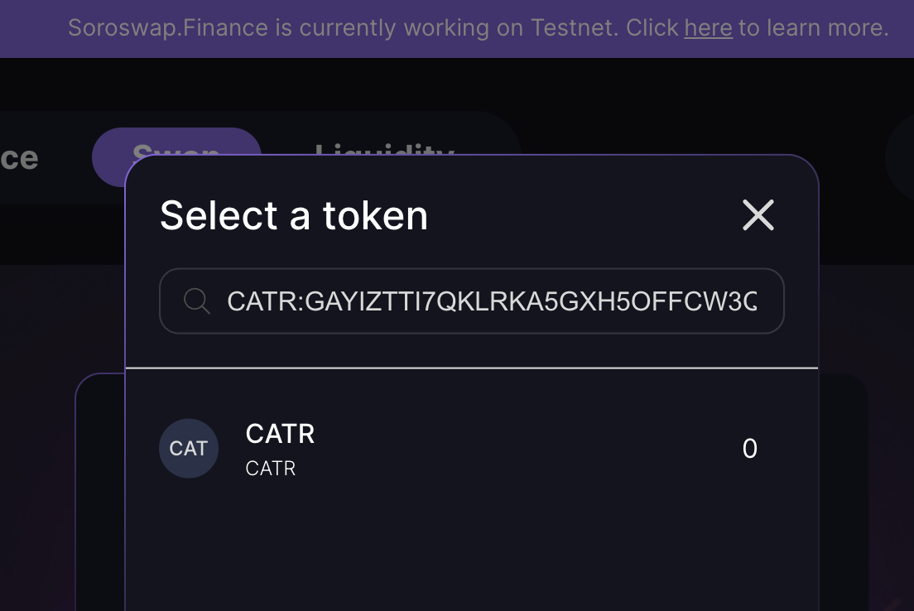

# Swap Stellar Classic Assets

With Soroswap you can now swap stellar classic assets, this allows you to exchange one token for a stellar assets or viceversa. Follow the steps below to perform a swap:

## Step 1: Navigate to the Swap page

1. In the swap page you can now paste/use stellar assets CODE:ISSUER or its corresponding Soroban address.

## Step 2: Select the token

if the token isn't known for us we will ask you to accept the following popup, this will also add the token to your tokens list.

## Step 3: Continue

You can follow the steps on [Doing Swap](../05-doing-swap.md)

Congratulations! you have successfully swapped a Stellar Classic Assets
