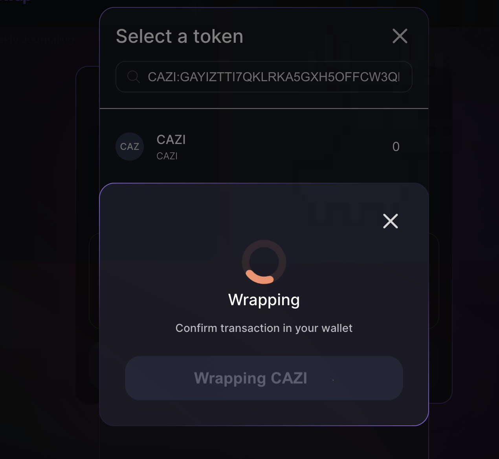

# Test Stellar Classic Assets

Experimenting with Stellar Classic assets on the Soroswap testnet is straightforward. Our API endpoint `/api/random_tokens` provides you with a variety of test tokens, including Stellar Classic assets that can be wrapped and used within the Soroban network.

## Accessing Test Tokens

To access the test tokens, follow these steps:

1. Navigate to the API endpoint for random tokens:
   * In a local enviroment: `http://localhost:8010/api/random_tokens`
   * In production/testnet: `https://api.soroswap.finance/api/random_tokens`
2. The API will return a JSON object containing an array of tokens indexed by network. Tokens with only the `asset` and `symbol` keys are Stellar Classic assets, whereas Soroban tokens will have additional information such as `address`, `name`, and `decimals`. To test remember to select the tokens from the network you are on.

Example response from the API:

```json
{
  "tokens": [
    // Soroban tokens with detailed information
    {
      "address": "CANYI627Y23JOJKXWMRSRIJLWUFBW5YPFMHGBMEX5A4OEH6QJYYSDVMS",
      "name": "axlnia",
      "symbol": "AXLN",
      "logoURI": "",
      "decimals": 7
    },
    // Stellar Classic assets with just asset code and issuer
    {
      "asset": "JAMN:GAYIZTTI7QKLRKA5GXH5OFFCW3QLU4LNSN5N3XIYXB4P56HHBIXC73X6",
      "symbol": "JAMN"
    }
    // ... more tokens
  ]
}
```

## Testing Wrapping Functionality

To test the wrapping functionality with Stellar Classic assets:

1. From the API's response, copy a Stellar Classic asset in the format `CODE:ISSUER`.
2. Go to the Soroswap testnet interface.
3. Paste the copied `CODE:ISSUER` into the search input from the Swap or Add liquidity pages, and select the asset from the results.
4. The interface will recognize that the asset is a Stellar Classic asset and offer you the option to wrap it for use on the Soroban network.


5. Click on the asset, and a wrapping modal will appear, guiding you through the wrapping process.



6. Once you initiate the wrapping process, you will be prompted to sign the transaction with your wallet.

After wrapping, the asset will be available in your Soroswap testnet account, ready for trading or adding to liquidity pools. This process allows you to interact with the asset as if it were native to the Soroban network, all within the safety of the testnet environment.

Testing Stellar Classic assets on Soroswap testnet is not only a valuable step for ensuring your assets are ready for live trading but also provides a risk-free way to familiarize yourself with the wrapping process and the broader Soroban ecosystem.
