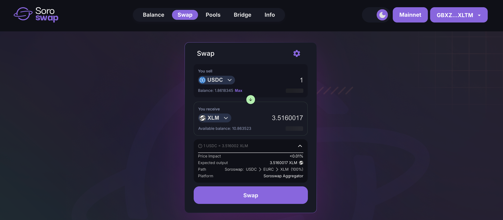

# How to Swap

The **Swap** section allows you to exchange one asset for another using liquidity provided by **Soroswap AMM** or, when available, optimized routes through the **Soroswap Aggregator**.

\
**Select the assets**\
Choose the asset you want to swap _from_ and the asset you want to receive. You can search or pick from the available list.

<figure><figcaption></figcaption></figure>

**Enter the amount**\
Input how much you want to swap. The app will automatically estimate how much you’ll receive.

<figure><figcaption></figcaption></figure>

**Best route via Aggregator (automatic)**\
If a better price is available by splitting the trade across multiple AMMs (e.g. Phoenix  AMM or Soroswap AMM), the **Aggregator** will route the swap automatically—no manual setup needed.

<figure><figcaption></figcaption></figure>

**Approve trustline (if needed)**\
If it’s your first time using the asset, you’ll need to sign a trustline to authorize it in your wallet.

**Confirm the swap**\
Review the swap details and sign the transaction in your wallet.

**Check the result**\
Once confirmed, your wallet balance will update. You can also view the transaction on [Stellar.Expert](https://stellar.expert/) or [StellarChain](https://stellarchain.io/).

#### ⚙️ Adjusting slippage tolerance

You can control how much price variation you’re willing to accept:

* Open the **Settings** panel
* Select a predefined slippage value (e.g. 0.5%) or enter a custom one
* Click **Save** to apply changes

> 📘 Need a full walkthrough with screenshots and tips? Follow the [Swap Tutorial](https://docs.soroswap.finance/05-tutorial/05-doing-swap)

***

🔄 **Next step:** Provide Liquidity\
🧠 **Learn more:** How the Aggregator Works
