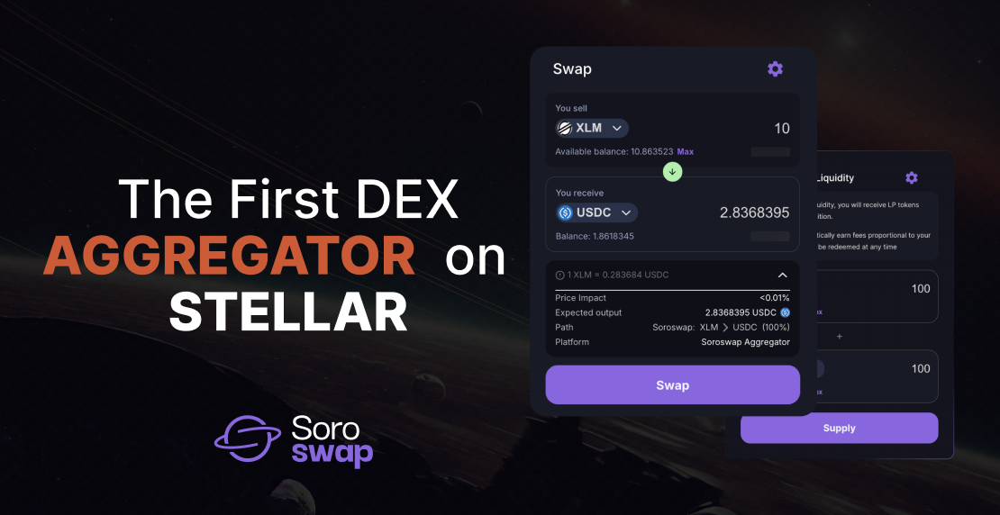

# What is Soroswap Finance?

[Soroswap.Finance](../) is an open-source protocol designed for liquidity provision and token trading on the Soroban blockchain. It operates without the need for intermediaries, ensuring a secure, transparent, and efficient trading environment. The protocol is immutable and built to resist censorship. Development of Soroswap.Finance and its interface is managed by [PaltaLabs.](https://paltalabs.io)

<figure><figcaption></figcaption></figure>

Soroswap.Finance includes:

* [**Soroswap AMM**:](https://docs.soroswap.finance/01-protocol-overview) An Automated Market Maker that facilitates token swaps and liquidity provision.
* [**Soroswap Aggregator**:](https://docs.soroswap.finance/soroswap-aggregator) An AMM Aggregator that optimizes trading routes across various liquidity pools.

### How to Use Soroswap.Finance

To interact with [Soroswap.Finance](../), you can mint test tokens, create [liquidity pools](https://docs.soroswap.finance/01-concepts/02-pools), [provide liquidity](https://docs.soroswap.finance/05-tutorial/04-adding-liquidity), or [swap tokens](https://docs.soroswap.finance/05-tutorial/05-doing-swap) using the Soroswap Interface. Connect your [Freighter wallet ](https://docs.soroswap.finance/05-tutorial/02-installing-freighter)to perform these actions. Note that transactions on Soroban require Lumens (XLM), so ensure [you have test ](https://docs.soroswap.finance/05-tutorial/01-soroswap-testnet-overviews)Lumens, which can be obtained from Friendbot.

### How Soroswap.Finance Works

Soroswap.Finance functions as an Automated Market Maker (AMM) through a network of smart contracts that standardize liquidity pool creation, liquidity provision, and asset swapping.

* **Liquidity Pools**: Each pool contains two assets. The pool’s reserves and pricing are managed dynamically by the protocol, updating with each trade.
* **Trading**: Unlike traditional exchanges, Soroswap does not use a central order book or private matching engines. Instead, reserves are automatically rebalanced, allowing continuous trading without the need for counterparties.

For more detailed information, refer to the [**Concepts**](https://docs.soroswap.finance/01-concepts) and [**Getting Started**.](https://docs.soroswap.finance/readme/getting-started)
