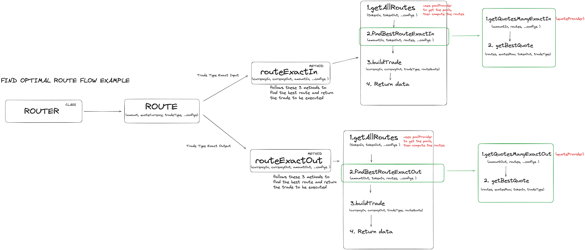

# soroswap-router-sdk

## Providers Classes

### `poolProvider`

* Maintains a `POOL_ADDRESS_CACHE` within the class, which caches pool addresses based on chainId/token0/token1.
* `getPoolAddress(tokenA, tokenB)` returns the address of the pool for the tokens, first checking the cache.
* `getPools(pairs, ...config)` Retrieves pool data and provides the following methods:
  * `getPool(tokenA, tokenB)`: calls getPoolAddress(tokenA, tokenB) and returns data for that pool address.
  * `getPoolByAddress(address)`: returns data for that pool address.
  * `getAllPools()`: returns data for all pools.

### `quoteProvider`

* `getQuotesManyExactIn(amountIn, routes, ...config)`: GetQuotes for exact in trades.
* `getQuotesManyExactOut(amountOut, routes, ...config)`: GetQuotes for exact out trades.
* `getQuotes(amounts, routes, tradeType, ...config)`: Returns the routes with their quotes (runs getQuotesManyExactOut or getQuotesManyExactIn depending on tradeType).

## Main Class: Router

### Methods

#### Public

* `routeExactIn(currencyIn, currencyOut, amountIn, ...configs)`: Finds the best route for exact input trades (getAllRoutes -> findBestRouteExactIn -> build trade and return data).
* `routeExactOut(currencyIn, currencyOut, amountOut, ...configs)`: Finds the best route for exact out trades (getAllRoutes -> findBestRouteExactOut -> build trade and return data).
* `route(amountCurrency, quoteCurrency, ...configs)`: Finds the best route (runs routeExactIn or routeExactOut depending on tradeType).

#### Private

* `getAllRoutes(tokenIn, tokenOut, ...configs)`: Gets all pools with the poolProvider, then returns possible routes for token0, token1.
* `getBestQuote(routes, quotesRaw, quoteToken, tradeType)`: Returns the route with the best quote.
* `findBestRouteExactIn(amountIn, tokenOut, routes, ...config)`: Uses the quote provider to get raw quotes and then sends them to getBestQuote to find the best quote.
* `findBestRouteExactOut(amountOut, tokenIn, routes, ...config)`: Uses the quote provider to get raw quotes and then sends them to getBestQuote to find the best quote.
* `buildTrade(currencyIn, currencyOut, tradeType, routeQuote)`: Creates the trade with the final route, tokens, and trade type.
* `validateKnownTokens(tokens)`: Validates that the tokens used in the swap are in the known tokens list.

